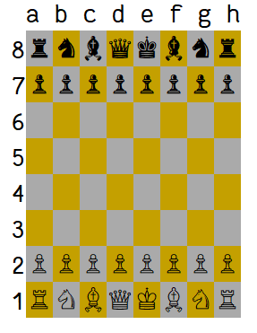

# Description

I'm not Chuck Norris. He didn't code this AI. But it will kick you hard! Hence, this kicking name.
By default it uses [MinMax with AlphaBeta pruning optimization](https://en.wikipedia.org/wiki/Alpha%E2%80%93beta_pruning). You can switch to [Monte Carlo Tree search](https://en.wikipedia.org/wiki/Monte_Carlo_tree_search) or Random with the configuration file. 
# Try it out
Run from code:
```
mvn spring-boot:run
```
Run jar:
```
java -jar Chuck-Norris-Chess-1.0.jar
```

If you terminal supports Unicode you should see something like this (I run it directly from IntelliJ):


To play, type your moves with this notation:
```
e2e4
e7e5
...
```

## Known issues
If the display is broken and you want to switch to the degraded mode go to next section (configuration) and uncomment this property: `#UI.UIConsole.enableUTF8=false`

# Configuration
Update `src/main/resources/application.properties` file and pass it at runtime to override default conf:
```
java -jar Chuck-Norris-Chess-1.0.jar --spring.config.location=src/main/resources/application.properties
```

# Dependencies
* Springboot to make it cool
* [Chesslib](https://github.com/bhlangonijr/chesslib) because they already coded all the game logic with bitboards, so why should I redo it?
* [Optional] [Fantasque sans](https://github.com/belluzj/fantasque-sans) font because it's awesome