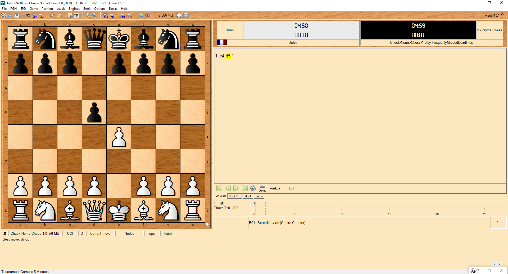

[]()
[](https://github.com/tterb/atomic-design-ui/blob/master/LICENSEs)
[](https://github.com/FrequentlyMissedDeadlines/Chuck-Norris-Chess)

# Description

I'm not Chuck Norris. He didn't code this AI. But it will kick you hard! Hence, this kicking name.
By default it uses [MinMax with AlphaBeta pruning optimization](https://en.wikipedia.org/wiki/Alpha%E2%80%93beta_pruning). You can switch to [Monte Carlo Tree search](https://en.wikipedia.org/wiki/Monte_Carlo_tree_search) or Random with the configuration file. 
# Try it out

## In Arena Chess GUI
This engine supports UCI protocol so it can be plugged in any polite compatible GUI. For Arena Chess ([download](http://www.playwitharena.de/)):
- If **Java 8+** is already installed on your computer go to next step. If not, you can [download](https://www.java.com/download/).
- Download the last version of the **JAR file** in [Releases page](https://github.com/FrequentlyMissedDeadlines/Chuck-Norris-Chess/releases).
- Open Arena Chess GUI
- Go to **Engines > Install New Engine** and select the previous **JAR file**
- Select UCI
- You should now be able to play against Chuck, enjoy being kicked!

## In standalone mode
Run jar:
```
java -jar Chuck-Norris-Chess-1.2.jar
```

If you terminal supports Unicode you should see something like this (I run it directly from IntelliJ):


To play, type your moves with this notation:
```
e2e4
e7e5
...
```

## Known issues
If the display is broken and you want to switch to the degraded mode go to next section (configuration) and uncomment this property: `#UI.UIConsole.enableUTF8=false`

# Configuration
Update src/main/resources/application.properties file and pass it at runtime to override default conf:
```
java -jar Chuck-Norris-Chess-1.2.jar --config.location=src/main/resources/application.properties
```

# Benchmarks
We can run the JAR with `benchmark` option to run JMH (figures depend on your hardware and Java version):
```
java -jar Chuck-Norris-Chess-1.2.jar benchmark

Benchmark                      Mode  Cnt   Score   Error  Units
AlphaBetaBenchmark.alphaBeta  thrpt    5  48,335 ± 0,720  ops/s
AlphaBetaBenchmark.negaMax    thrpt    5  45,252 ± 0,642  ops/s
```

# Dependencies
* [Chesslib](https://github.com/bhlangonijr/chesslib) because they already coded all the game logic with bitboards, so why should I redo it?
* [Chess-UCI](https://github.com/FrequentlyMissedDeadlines/Chess-UCI) to plug my engine on any standard GUI.
* [Apache commons configuration](https://commons.apache.org/proper/commons-configuration) to deal with config files.
* [Optional] [Fantasque sans](https://github.com/belluzj/fantasque-sans) font because it's awesome.
